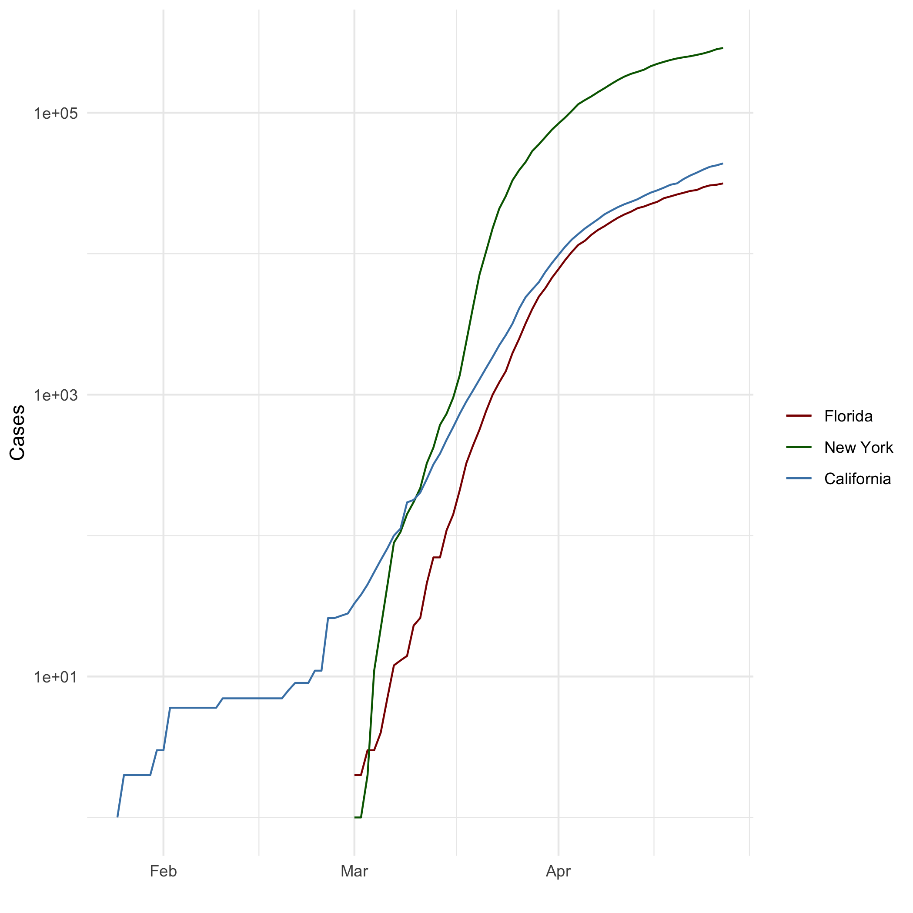

# Markdown Basics

## Favorite Foods
1. Pan seared salmon
2. Rib steak
3. Mushroom pizza

## Images



## Add a Quote

> "If you want to achieve greatness stop asking for permission."
>
> ---Anonymous

## Add an Equation

$$ x = \frac{-b\stackrel{+}{-} \sqrt(b^2-4ac)}{2a} $$

## Add a Footnote

This is a footnote^[This is the footnote.]

## Add Citations

* R for Everyone [@lander2014r]
* Discovering Statistics Using R [@field2012discovering]

# Inline Code

```{r, include=FALSE}
library(ggplot2)
heights_df <- read.csv("data/r4ds/heights.csv")
covid_df <- read.csv("data/nytimes/covid-19-data/us-states.csv")

## Parse the date column using `as.Date()``
covid_df$date <- as.Date(covid_df$date)

## Create three dataframes named `california_df`, `ny_df`, and `florida_df`
## containing the data from California, New York, and Florida
california_df <- covid_df[ which( covid_df$state == "California"), ]
ny_df <- covid_df[which(covid_df$state == "New York"),]
florida_df <- covid_df[which(covid_df$state == "Florida"),]
```

## NY Times COVID-19 Data

```{r, echo=FALSE}
ggplot(data=florida_df, aes(x=date, group=1)) +
  geom_line(aes(y = cases, colour = "Florida")) +
  geom_line(data=ny_df, aes(y = cases,colour="New York")) +
  geom_line(data=california_df, aes(y = cases, colour="California")) +
  scale_colour_manual("",
                      breaks = c('Florida','New York' ,'California'),
                      values = c('darkred', 'darkgreen', 'steelblue')) +
  xlab(" ") + ylab("Cases") + scale_y_log10()
```

## R4DS Height vs Earnings

```{r, echo=FALSE}
ggplot(heights_df, aes(x= height, y= earn, col= sex)) + geom_point() + ggtitle('Height vs. Earnings') +
  xlab('Height (Inches)') + ylab('Earnings (Dollars)')
```

# Tables

## Knitr Table with Kable

```{r, echo=FALSE}
library(knitr)
name <- c("Aragon", "Bilbo", "Frodo", "Galadriel", "Sam", "Gandalf", "Legolas", "Sauron", "Gollum")
race <- c("Men", "Hobbit", "Hobbit", "Elf", "Hobbit", "Maia", "Elf", "Maia", "Hobbit")
in_fellowship <- c(TRUE, FALSE, TRUE, FALSE, TRUE, TRUE, TRUE, FALSE, FALSE)
ring_bearer <- c(FALSE, TRUE, TRUE, FALSE, TRUE, TRUE, FALSE, TRUE, TRUE)
age <- c(88, 129, 51, 7000, 36, 2019, 2931, 7052, 589)

characters_df <- data.frame(name, race, in_fellowship, ring_bearer, age)

knitr::kable(characters_df, caption = 'One Ring to Rule Them All' )
```

## Pandoc Table

```{r, include=FALSE}
library(pander)
colnames(characters_df) <- c('Name','Race','Is In Fellowship?','Is Ring Bearer?','Age')
pandoc.table(characters_df, style = "rmarkdow", justify = c('llllr'))
```
| Name      | Race   | Is In Fellowship? | Is Ring Bearer? |  Age |
|:----------|:-------|:------------------|:----------------|-----:|
| Aragon    | Men    | TRUE              | FALSE           |   88 |
| Bilbo     | Hobbit | FALSE             | TRUE            |  129 |
| Frodo     | Hobbit | TRUE              | TRUE            |   51 |
| Galadriel | Elf    | FALSE             | FALSE           | 7000 |
| Sam       | Hobbit | TRUE              | TRUE            |   36 |
| Gandalf   | Maia   | TRUE              | TRUE            | 2019 |
| Legolas   | Elf    | TRUE              | FALSE           | 2931 |
| Sauron    | Maia   | FALSE             | TRUE            | 7052 |
| Gollum    | Hobbit | FALSE             | TRUE            |  589 |


# References
